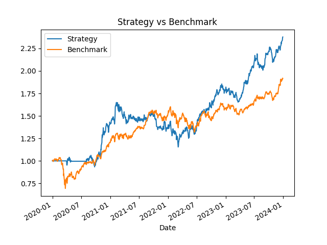

# 📈 Multi-Factor Alpha Strategy (Nifty Stocks)

## 🚀 Overview

This project implements a **multi-factor equity trading strategy** using momentum and volatility-based signals on Indian equity markets.

The goal is to construct a **systematic, data-driven portfolio** that outperforms a benchmark while controlling risk.

---

## 🧠 Strategy Logic

The model combines multiple quantitative signals:

### 📊 Factors Used

* **Momentum (Primary Signal)**
  Captures trend persistence using 20-day returns.

* **Volatility Filter**
  Avoids highly volatile stocks to reduce risk.

* **Trend Filter**
  Allocates higher weight to stocks trading above their 50-day moving average.

---

### ⚙️ Portfolio Construction

* Rank stocks daily based on combined alpha score
* Select **top-performing stocks (top 2–3)**
* Equal-weight allocation among selected stocks
* Apply **monthly rebalancing**

---

### 💰 Backtesting Features

* Transaction cost modeling (0.1% per trade)
* Turnover calculation
* Cumulative return tracking
* Benchmark comparison (equal-weight portfolio)

---

## 📊 Results

| Metric           | Value |
| ---------------- | ----- |
| **CAGR**         | ~24%  |
| **Sharpe Ratio** | ~1.2  |
| **Max Drawdown** | ~30%  |
| **Total Return** | ~138% |

---

## 📉 Strategy vs Benchmark



---

## 🧪 Key Insights

* Momentum is the dominant driver of returns
* Monthly rebalancing improves stability and reduces noise
* Risk filters help control drawdowns but may reduce returns
* Strategy demonstrates **positive alpha vs benchmark**

---

## ⚠️ Limitations

* Small universe (10 stocks)
* No out-of-sample validation
* No sector constraints
* Limited factor set

---

## 🔮 Future Improvements

* Expand to **Nifty 50 universe**
* Add more factors (value, quality, volume)
* Implement position sizing models
* Perform walk-forward validation
* Build a full backtesting engine

---

## 🛠️ Tech Stack

* Python
* Pandas
* NumPy
* Matplotlib
* yFinance

---

## 📌 How to Run

```bash
pip install pandas numpy matplotlib yfinance
python project1.py
```

---

## 👨‍💻 Author

Parth Sarthi Saxena

---

## ⭐ Acknowledgment

This project was built as part of a self-driven effort to learn **quantitative finance, alpha research, and systematic trading strategies**.
